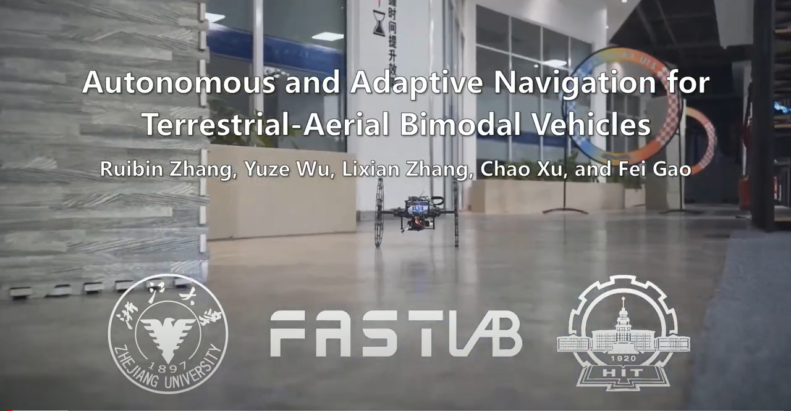

# Terrestrial-Aerial-Navigation

**Terrestrial-Aerial-Navigation** is an autonomous navigation framework that brings complete autonomy to terrestrial-aerial bimodal vehicles (TABVs). This repository contains the following sub-modules:

- A bi-level motion planner which generates safe, smooth, and dynamically feasible terrestrial-aerial hybrid trajectories.
- A customized [TABV platform](https://github.com/ZJU-FAST-Lab/TABV-Platform) that carries adequate sensing and computing resources while ensuring portability and
  maneuverability.

# About
If our source code or hardware platform is used in your academic projects, please cite the related paper below.

- [Autonomous and Adaptive Navigation for Terrestrial-Aerial Bimodal Vehicles](https://ieeexplore.ieee.org/document/9691888) , Ruibin Zhang, Yuze Wu, Lixian Zhang, Chao Xu, and Fei Gao, IEEE Robotics and Automation Letters (**RA-L**), 2022.

```
@ARTICLE{Zhang2022TABV,
      author={Zhang, Ruibin and Wu, Yuze and Zhang, Lixian and Xu, Chao and Gao, Fei},
      journal={IEEE Robotics and Automation Letters}, 
      title={Autonomous and Adaptive Navigation for Terrestrial-Aerial Bimodal Vehicles}, 
      year={2022},
      volume={7},
      number={2},
      pages={3008-3015}
}
```
Video Links: [Youtube](https://www.youtube.com/watch?v=Bdb5mK9OKIo&feature=youtu.be).

  <p align="center">
    
  </p>

</a>

# Quick Start
Compiling tests passed on ubuntu 18.04. You can just execute the following commands one by one.
```
sudo apt-get install libarmadillo-dev ros-melodic-nlopt
git clone https://github.com/ZJU-FAST-Lab/Terrestrial-Aerial-Navigation.git
cd Terrestrial-Aerial-Navigation
catkin_make
source devel/setup.bash
sh src/run.sh
```
Then, you can trigger the planner and choose the planning goal using the ```2D Nav Goal``` tool in ```rviz```. Then, the TABV will follow terrestrial-aerial hybrid trajectories to navigate a  random forest map and cross a high barrier :

<p align = "center">

</p>

[NOTE] remember to change the CUDA option of **src/uav_simulator/local_sensing/CMakeLists.txt**, i.e., change the 'arch' and 'code' flags in the line of 

    set(CUDA_NVCC_FLAGS 
      -gencode arch=compute_61,code=sm_61;
    ) 

according to your Nvidia graphics card version. You can check the right code [here](https://github.com/tpruvot/ccminer/wiki/Compatibility).


# Acknowledgements
We build on [Fast-Planner](https://github.com/HKUST-Aerial-Robotics/Fast-Planner) by extending its path searching and trajectory generation methods to TABV motion planning. We use  [NLopt](https://nlopt.readthedocs.io/en/latest/)  for solving nonlinear optimization problems in trajectory generation.

# Licence
The source code is released under [GPLv3](https://www.gnu.org/licenses/) license.

# Maintenance
We are still working on extending the proposed system and improving code reliability.

For any technical issues, please contact Ruibin Zhang (ruibin_zhang@zju.edu.cn) or Fei Gao (fgaoaa@zju.edu.cn).

For commercial inquiries, please contact Fei Gao (fgaoaa@zju.edu.cn).
